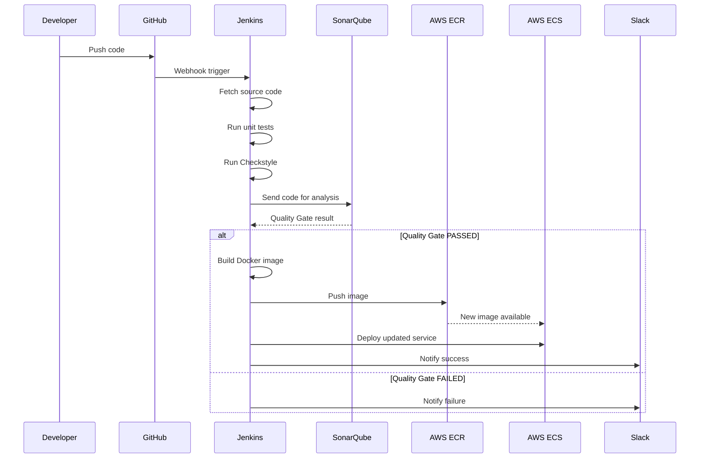

# CI/CD Pipeline: Jenkins – SonarQube – Docker – AWS ECS

## Introduction
This project demonstrates a production-ready CI/CD pipeline for containerized applications using Jenkins, SonarQube, Docker, and AWS ECS.
The pipeline automatically:
- Fetches source code from GitHub
- Runs unit tests and static code checks
- Enforces code quality via SonarQube Quality Gate
- Builds Docker images
- Pushes images to AWS ECR
- Deploys applications to AWS ECS
- Sends build notifications to Slack
The goal of this project is to showcase DevOps best practices including automation, code quality enforcement, containerization, and cloud-native deployment.

## Architecture

# Workflow details

## Tech Stack
CICD & Devops
- Jenkins
- GitHub
- SonarQube
- Docker
Cloud & Container
- AWS ECS
- AWS ECR
- AWS IAM
Other
- sonarQube Quality Gate
- Slack Integration
