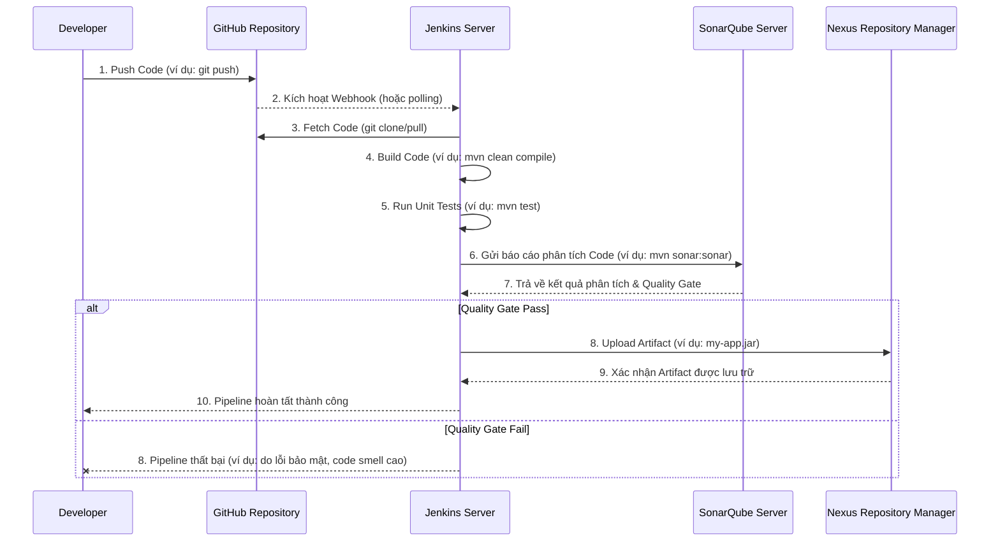

# CI Pipeline with Jenkins 

## Introduction
This project etablishes a continuos integration (CI) automation process using Jenkins to ensure code quality and manage artifacts effectively.

## Architecture

## Workflow Details

## Tech Stack
- CI Tool: Jenkins
- Source Control: GitHub
- Static Code Analysis: SonarQube
- Artifact Management: Nexus OSS
- Build Tools: Maven

## Install and using
- System req: jenkins, nexus, sonarqube, firewall, plugins
- Intergrate: nexus, sonarqube
- Write Pipeline script
- Set notification
